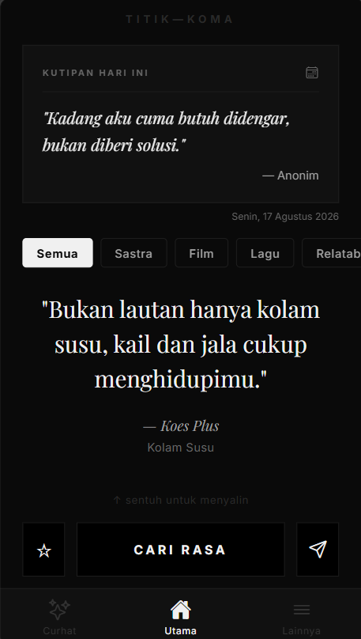
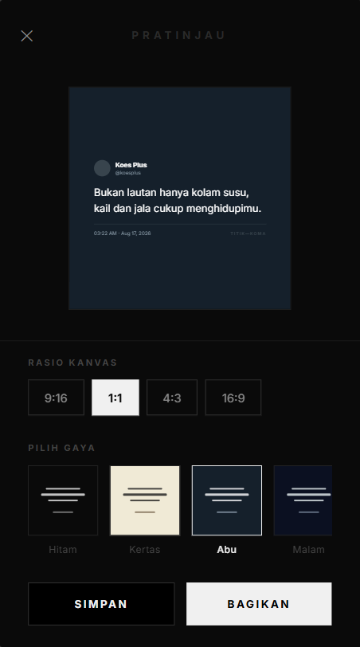
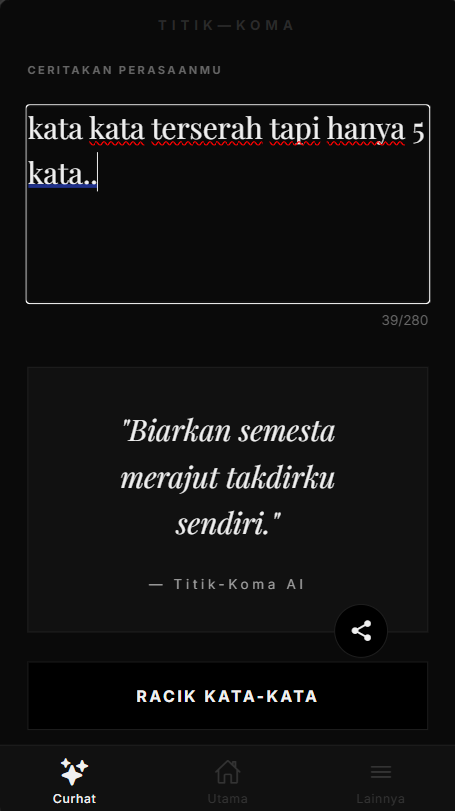
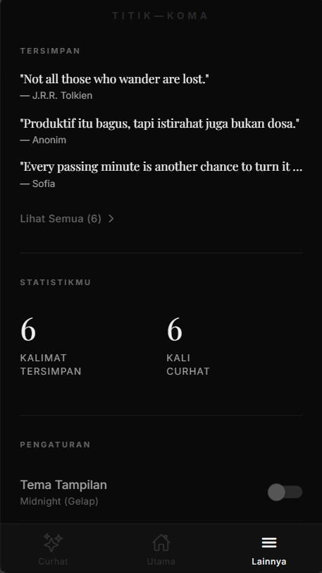

# ✒️ TITIK—KOMA

> *"Productivity is great, but resting is not a sin."*

Titik-Koma is a minimalist mobile application designed to be a digital resting place. A quiet space away from hustle culture and social media noise, offering a curated collection of relatable quotes and an empathetic AI listener.

<div align="center">
  
  
  
  
</div>

## ✨ Features

- **Curated Quote Collection**  
  A hand-picked selection of aesthetic song lyrics, movie dialogues, and literary quotes. Filter by *Literature*, *Movies*, *Songs*, *Relatable*, or short-form *IG Notes*.
  
- **AI Listener (Curhat AI)**  
  Powered by Google Gemini. Type whatever is on your mind—venting, burnout, or overthinking—and the AI will respond with a specific, validating quote that resonates with your feelings.

- **Aesthetic Canvas Export**  
  Export your favorite quotes into high-resolution, beautifully designed images ready for Instagram Stories or X. 
  Choose from 4 visual themes:
  - **Midnight:** Bold, neo-brutalism.
  - **Kertas:** Classic, vintage polaroid texture.
  - **Abu:** Clean, modern thread-style.
  - **Malam:** Starry night, music player interface.
  
  *Supports automatic rendering for 1:1, 4:3, 16:9, and 9:16 aspect ratios.*

- **Quote of the Day**  
  A unique, deterministically generated quote to greet you every time you open the app on a new day.

- **Private Bookmarks**  
  Save quotes that resonate with you to your offline personal collection.

## 🛠️ Tech Stack

- **Framework:** [React Native](https://reactnative.dev/) & [Expo](https://expo.dev/) (Expo Router)
- **Styling:** Custom Design System (Vanilla React Native StyleSheet)
- **AI Integration:** `@google/generative-ai` (Gemini API)
- **Storage:** `@react-native-async-storage/async-storage` (100% local, privacy-first)
- **Libraries:** `expo-haptics`, `react-native-view-shot` (HD Canvas rendering), `expo-clipboard`.

## 🚀 Getting Started

To run this project locally:

1. **Clone the repository**
   ```bash
   git clone https://github.com/yourusername/TitikKoma.git
   cd TitikKoma
   ```

2. **Install dependencies**
   ```bash
   npm install
   ```

3. **Set up environment variables**
   Create a `.env` file in the root directory and add your Gemini API key:
   ```env
   EXPO_PUBLIC_GEMINI_API_KEY=your_gemini_api_key_here
   ```

4. **Start the development server**
   ```bash
   npx expo start --clear
   ```
   *Scan the QR code with the Expo Go app on your phone, or press `a` for Android Emulator / `i` for iOS Simulator.*

## 📄 License

Distributed under the MIT License. Feel free to use, modify, and learn from this project. 
Don't forget to take a rest today.
